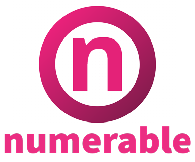
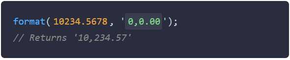

<p align="center">
  
</p>

<p align="center">
  
</p>

# [numerable](https://github.com/gastonmesseri/numerable)

**numerable** is a Javascript library with a set of formatting and manipulation tools for dealing with numbers.


## Installation

Use [npm](https://www.npmjs.com/) or [yarn](https://yarnpkg.com/) to install **numerable**.

```bash
npm install --save numerable
# or
yarn add numerable
```


## Usage

```javascript
import { format, parse, round } from 'numerable';

format(1500250.2, '0,0.00');
//=> '1,500,250.20'

format(0.25, '0.0 %');
//=> '25.0 %'

parse('80.5%');
//=> 0.805

round(25.4875, 2);
//=> 25.49
```


## Contributing

Pull requests are welcome. For major changes, please open an issue first to discuss what you would like to change.

Please make sure to update tests as appropriate.


## License

[MIT](https://choosealicense.com/licenses/mit/)
